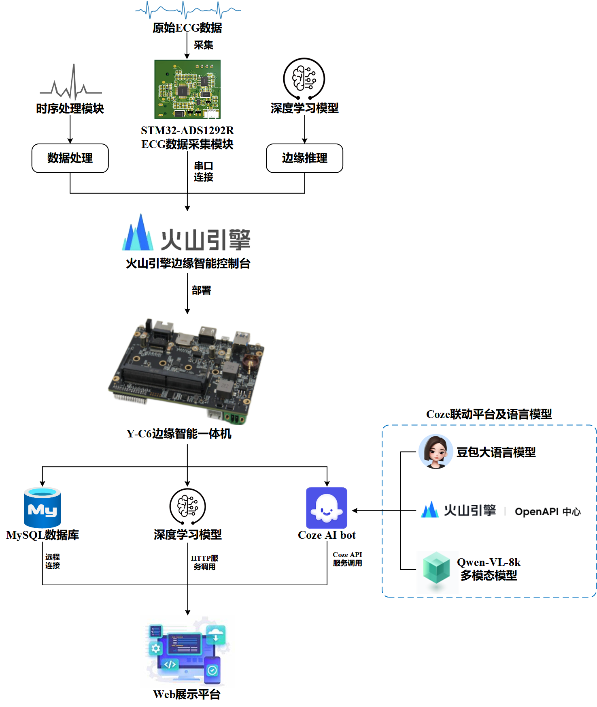

# 基于火山引擎的心梗快速检测系统（A325实验室）
基于火山引擎的心梗快速检测系统结合了深度学习、边缘计算与心电图（ECG）分析技术等前沿技术，具备实时ECG监测与分析、边缘智能处理、个性化健康预警、Web应用集成的功能。本项目以AMI的快速检测为核心目标，结合边缘智能技术的优势，为AMI的预防和救治提供了一种新的解决方案。该系统总体框架图如下：



# 使用指南
根据readme中运行环境安装对应的依赖包，然后运行text.py文件，即可进入设计好的web页面中，与AI机器人进行对话，调用火山引擎边缘智能的模型推理服务对创建的MySQL服务器中的ECG数据进行诊断，若判断为心肌梗死也会将诊断信息发送到展示的web页面中。

## 安装依赖项

> python=3.9.18
> 
```
pip install -r requirements.txt
pip install PyWavelets wfdb
pip install tritonclient[http]
```

## 运行指令

```
python text.py
```

## 文件说明
ana.py文件用于从数据库中加载信号数据、对其进行预处理和特征提取，然后利用 Triton Inference Server上部署的模型对信号进行分类（判断是否为心梗）。最后会返回一个整数值，表示模型的分类结果（0 表示心梗，1 表示正常），并且打印相应的诊断信息。

bot.py文件通过调用Coze AI bot的API实现与聊天机器人进行交互，发送用户的消息，并通过流式传输的方式接收机器人的回复。同时，它能够处理各种网络和 API 错误，并且在遇到问题时能够返回错误信息。

main.py实现了对心电图（ECG）信号的分析，涉及了信号预处理、特征提取、心跳分割、以及使用远程服务器进行分类预测等步骤，可以将分割好的心跳周期发送给远程 Triton 服务器进行分类预测。

yy.py文件通过调用火山引擎多模态大模型qwen-vl-8k的API，实现了部署多模态大模型，并利用大模型帮助用户分析病例的功能。

text.py文件构建了使用 Flask 框架的简单 Web 应用程序，这个Web应用实现了以下功能：1. 用户登录验证。2. 提供数据库，数据上传后可以准确判断是否心梗，同时数据能定期更新。3. 提供文件上传功能，并分析上传的文件。4. 与AI机器人交互，发送消息并接收响应。 5. 上传病例并分析。

# 注意事项
本项目为算法联动火山引擎边缘智能进行推理服务的一次具体应用，用于参加全国大学生物联网设计大赛。


